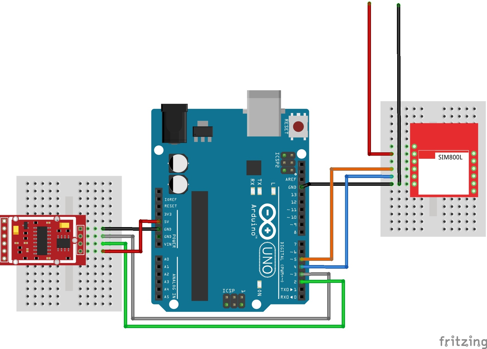

# Sm@rtbee
The main objective of this project is to describe the behavior of bees in healthy hives and ready for pollination. Through real-time and minimally invasive monitoring, data from hives and colonies will be collected through heterogeneous sensors, connected to sensing devices with embedded radios. The data will be stored in a computational cloud and accessed remotely via the Web.

## Getting Started

These instructions will get you a copy of the project up and running on your arduino for development and testing purposes.

### Prerequisites

```
The Arduino IDE
Thingspeak account

Microcontroller: ........... Arduino Uno
Weight Sensor: ............. Load Cell Straight Bar - 50 kg
Load Cell Amplifier: ....... HX711
GSM Module: ................ SIM800L
```

### Libraries

You can find it [here](Bibliotecas).
```
- HX711
```

### Installing

The steps to get the project up and running:

#### Step 1: Install the library

   1. Download the .zip library. [Here](Bibliotecas)
   2. Follow this tutorial from Arduino website and go to section "Importing a .zip Library". [Here](https://www.arduino.cc/en/Guide/Libraries)

#### Step 2: Install the hardware on arduino

   1. Connecting GSM Module
   
         To connect the gsm module on arduino, look at the table down below, connect the wires in their respective PINs in the arduino and in the gsm module and don't forget to read the note about powering up the gsm module. After the table there is a diagram of the connections.
   
      | Wire Color  | SIM800L PIN | Arduino PIN | Notes |
      | :-------------: | :-------------: | :-------------: | :-------------: |
      | RED  | VCC | --- | Read the note down below |
      | BLACK  | GND  | GND  |
      | ORANGE  | RXD  | 5 |
      | BLUE  | TXD | 4  |
      
      >**The wires to power up the SIM800L module can't be connected on Arduino. 
      >It's necessary to power up the module with a supply voltage of 3.4V - 4.4V that can handle a peak of current of 2A.**

      <p align="center">
         
      </p>
   
 
   2. Connecting HX711
      
      To connect the HX711 on arduino, look at the table down below, connect the wires in their respective PINs in the arduino and in the HX711. After the table there is a diagram of the connections.
         
      >**Since we already connected the gsm module on the previous step, we're going to focus only on the HX711 conections.**


      | Wire Color  | HX711 | Arduino PIN| 
      | :-------------: | :-------------:|:-------------:|
      | RED  | VCC | 5V |
      | BLACK  | GND  | GND  |
      | GRAY  | DT/RX  | 3 |
      | GREEN  | SCK | 2  |
   
      <p align="center">
         
      </p>

   3. Mounting the Load Cells
   4. Connecting the Load Cells on HX711
   
      To connect the load cells on HX711, look at the table down below, connect the wires off the load cells in their respective PINs of the HX711. After the table there is a diagram of the connections.
      >**Again, since we already connected the HX711 and the gsm module on the previous step, 
       we're going to focus only on the Load Cell conections.**
       
      | Load Cell Wire Color  | HX711 PIN | 
      | :-------------: | :-------------: | 
      | RED  | S+/E+ | 
      | BLACK  | S-/E-  | 
      | WHITE  | A+  | 
      | GREEN  | A- |

 
      <p align="center">
         
      </p>
      
#### Step 3: Find the scale factor

Before you are able to start measuring, you need to find the scale factor of the load cells that are going to be used. First, upload the scaleFactor sketch to your arduino, then, open the serial monitor, put some known weight over the load cells and press a,s,d,f to increase calibration factor by 10,100,1000,10000 respectively or press z,x,c,v to decrease calibration factor by 10,100,1000,10000 respectively, until you see the correct readings.

Once the known weight is showed over the serial monitor, right down the scale factor found, because it's going to be used in the weightMeasure sketch.

>This sketch was found here: https://circuits4you.com/2016/11/25/hx711-arduino-load-cell/

#### Step 4: Configure the weightMeasure

Before you are able to start measuring, you also need to changes some parameters in the sketch. The first parameter you need to change is the *calibration_factor* that you found in the previous step, after, you need to change the *API_KEY* for your Api-key from ThingSpeak and then update *APN*, *USER*, *PASS* for your gsm network's apn, user and pass.

>The initial work of this sketch was found here: https://circuits4you.com/2016/11/25/hx711-arduino-load-cell/, and it was modified to send the data collected over the SIM800L module

## Authors

* **Lucas Esteves Rocha** - [Esteves4](https://github.com/Esteves4)
* **Sara Lonngren**  - [saralonngren](https://github.com/saralonngren)

## License

This project is licensed under the MIT License - see the [LICENSE.md](../LICENSE) file for details
